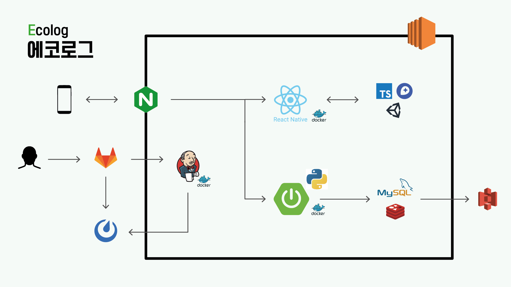
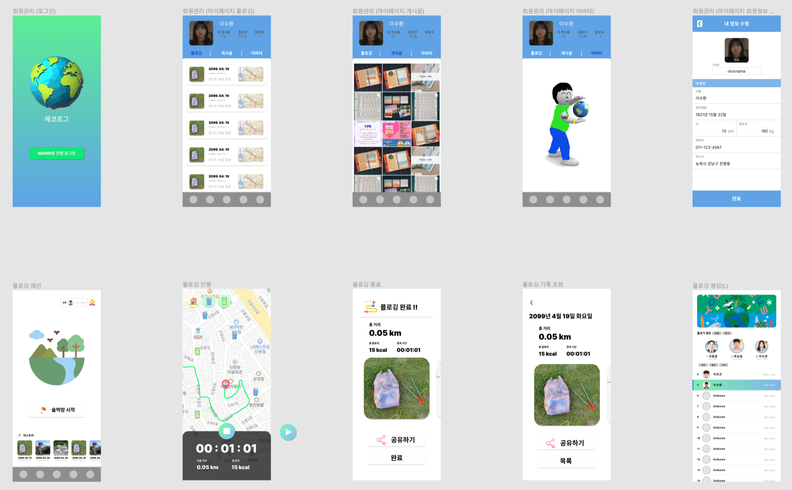

# **에코로그**

**건강한 지구를 만드는 아름다운 기록 ‘에코로그’**

> ’플로깅’ 또는 ‘용기내 챌린지’ 에 대해 들어보신 적 있으신가요?
>
> 지구의 생태계가 훼손되기까지 약 70년 밖에 걸리지 않았습니다.
> 이러한 문제를 해결하기 위해 단체뿐만 아니라 개개인들도 ‘플로깅’ 과 같은 환경 보호 캠페인에 참여하고 있습니다.
>
> 우리들의 터전을 지키기 위해 아름다운 기록에 동참하세요.

 

## :recycle: 홍보 사이트

https://ecolog.co.kr/ 에서 어플리케이션을 만나보실 수 있습니다.

### 목차

- :book: [주요 기능](#book-주요-기능)
- :books: [세부 기능](#books-세부-기능)
- :computer: [개발 환경](#computer-개발-환경)
- :classical_building: [아키텍쳐](#classical_building-아키텍처)
- :bookmark_tabs: [산출물](#bookmark_tabs-산출물)
- :family: [팀 소개](#family-팀-소개)

 

## :book: 주요 기능

- 원활한 플로깅을 위해 활동 정보 기록, 랭킹 조회 등 기능 제공
- 환경 보호 캠페인을 함께 할 사람을 모으고, 실천 여부를 공유하기 위한 커뮤니티 기능 제공
- 환경에 좋은 생활 습관을 가졌는지 알아볼 수 있는 설문 테스트 제공
- 환경 보호 활동으로 보상을 얻어 마이룸 / 아바타를 꾸밀 수 있는 기능 제공

 

## :books: 세부 기능

| 구분 | 기능                       | 설명                                                                                                             | 비고 |
| ---- | -------------------------- | ---------------------------------------------------------------------------------------------------------------- | ---- |
| 1    | 회원 관리                  | 소셜 회원 가입 및 회원 정보 조회, 수정을 할 수 있다.                                                             |      |
| 2    | 팔로우 / 언팔로우          | 다른 회원을 팔로우하여 환경 운동을 함께 할 파트너를 만들 수 있다.                                                |      |
| 3    | 플로깅                     | 위치 기반 플로깅 진행 경로, 시간, 거리, 칼로리를 기록할 수 있고, 사진과 함께 결과를 조회 및 공유할 수 있다.      |      |
| 4    | 플로깅 랭킹                | 주간 / 월간 / 전체 기간 별로 전체 회원 / 내 지역 / 지인 별 랭킹을 조회하고 리워드를 얻을 수 있다.                |      |
| 5    | 주변 쓰레기통 조회         | 플로깅 중 발생한 쓰레기의 배출을 돕기 위해 쓰레기통의 위치를 조회하고 등록할 수 있다.                            |      |
| 6    | 환경 캠페인 커뮤니티       | 환경 운동 현황을 게시글로 공유하고, 캠페인을 함께 할 사람을 모집할 수 있다.                                      |      |
| 7    | 생활 습관 설문조사 및 공유 | 환경에 관한 생활 습관 테스트를 진행하여 내 생활 습관을 돌아보고, 결과를 공유하여 사람들의 흥미를 유발할 수 있다. |      |
| 8    | 아바타, 방 꾸미기          | 플로깅 및 환경 캠페인 참여를 통해 받은 리워드를 사용해 아바타와 방을 꾸밀 수 있다.                               |      |

## :computer: 개발 환경

### Frontend

- HTML5, CSS3, TypeScript 4.6.2
- React-Native 0.68.1
- React-Redux 8.0.1, Redux-Saga 1.1.3, React-Query 3.38.0
- React-Native-Paper 4.12.0, MapboxGL 8.2.1
- Node.js 16.14.2, npm 8.5.5
- Unity 2021.3.2f1

### Backend

- Java JDK 8
- SpringBoot 2.4.5, Spring JPA, Spring Security
- Lombok 1.18.20, Swagger 3.0.0, jwt 3.19.1

### DB

- MySQL 8.0.28
- Redis 6.2

### Server

- AWS EC2, AWS S3, Ubuntu 20.04
- Jenkins 2.303.2, nginx 1.18.0
- Docker 20.10.14, docker-compose 1.29.2
- Putty

### Tools

- 형상관리 : GitLab
- 이슈관리 : Jira
- 커뮤니케이션 : Mattermost, Notion, Discord
- 디자인 : Figma
- OS : Windows 10
- IDE
  - IntelliJ 2021.3.2
  - MySQL Workbench 8.0.28
  - Visual Studio Code 1.65.2
  - Android Studio

## :classical_building: 아키텍처

## :bookmark_tabs: 산출물

### 와이어프레임

### ER Diagram

## :family: 팀 소개

- 박승원 (팀장) : Back-End
- 이진곤 : Back-End, Unity
- 지수연 : Back-End
- 이수환 : Front-End, Unity
- 이재희 : Front-End
- 이종현 : Front-End
